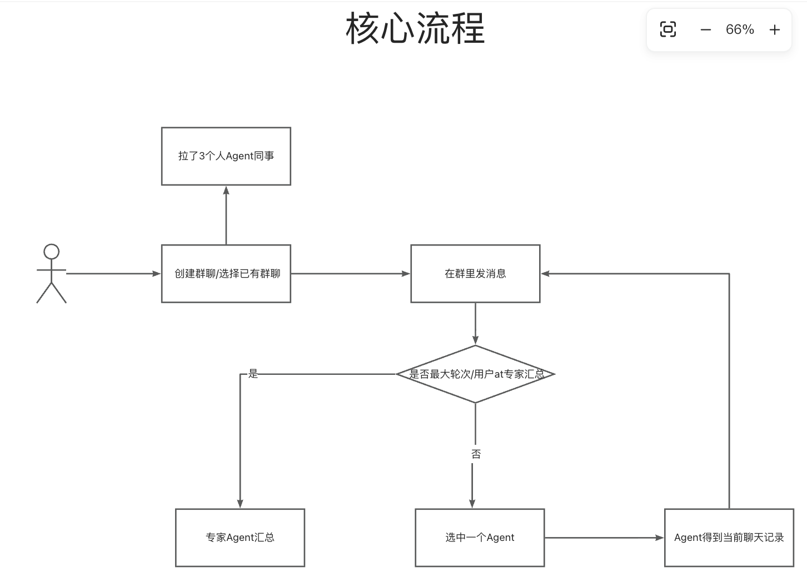
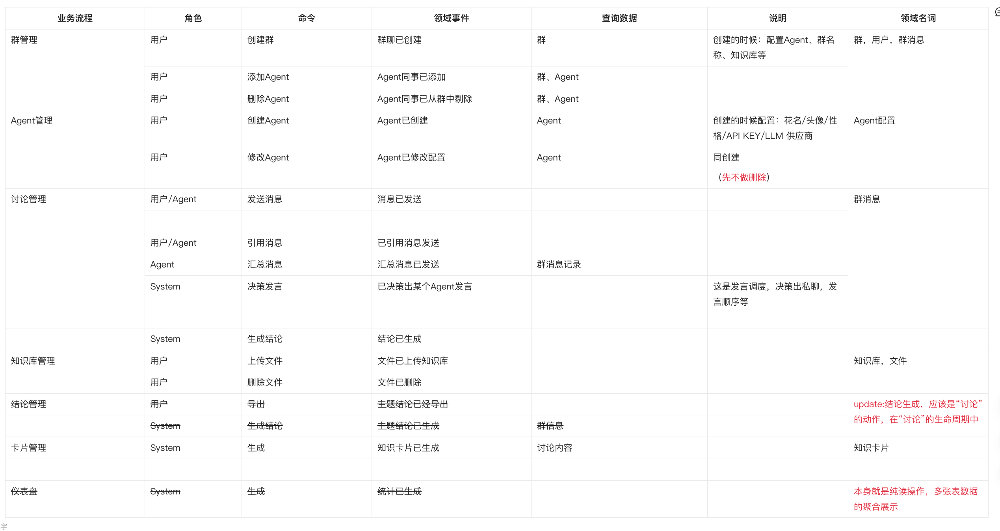
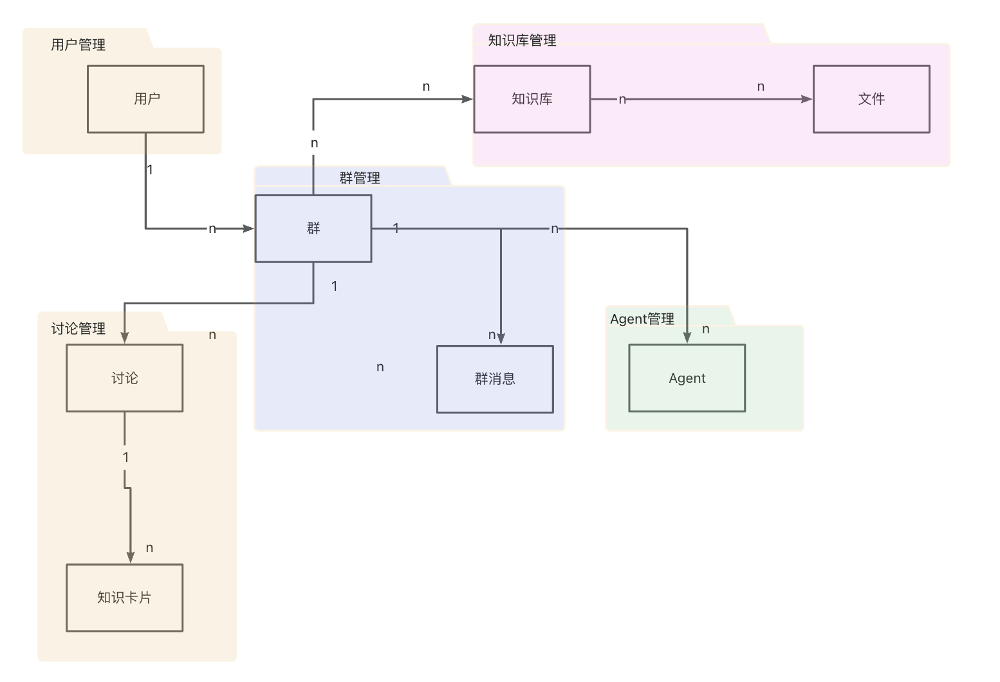
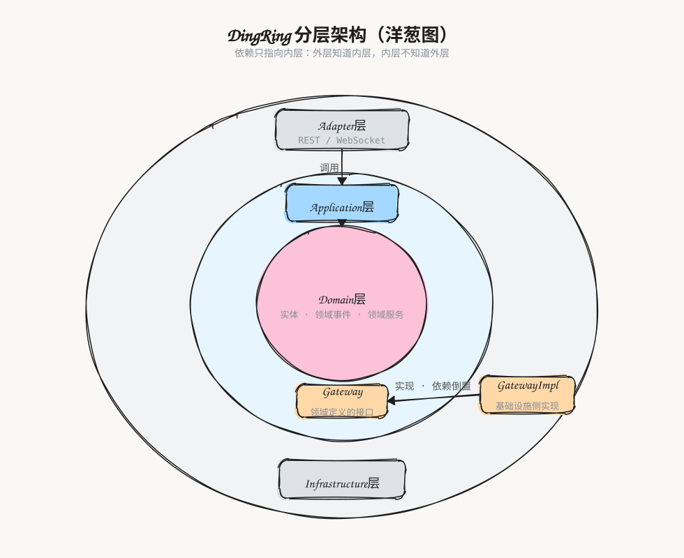

# DingRing 的 DDD 实践 · 建模篇：从事件风暴到 COLA4.0 落地

## 前言

在过往的工作经历中，经常会遇到这样一些问题：“新增一个服务放A模块还是B模块？”“A同学在X包新增了一个类使用，B同学在Y包新增了一个类使用，最终发现二者是复用的”。诸如代码组织和代码职责不清的问题会随着业务迭代越来越暴露无遗（**熵增**），最终，是给开发同学套上了一层又一层的枷锁。尽管身处AI时代，我们大部分读代码和理解代码的成本可以让AI去承担，但是，不良混乱的代码还是会给开发人员增加心智负担，稀释开发人员的判断力。而DDD是可以有效对抗混乱的方法论。

## DingRing中的DDD

> 重在展示关键过程，一些实体和表设计在迭代过程中有所调整
>
> 摒弃了聚合根、值对象等复杂概念，重在落地

### 事件风暴

按照传统的DDD落地步骤，需要开发和领域专家坐在一起去梳理关键的业务流程，需要“统一语言”，但实际上，作为个人的开源学习项目，我和AI进行了相关的头脑风暴。

在最开始我大致梳理了一个核心流程（这个我觉得可以归类为Use case，是捕获行为需求的一种方式）：

> 很简陋，但是没关系，有大致的骨架就OK

根据核心流程，得到一张大的“事件风暴”表格：

> 这张表格，基本囊括了DingRing所需的“部件”的描述

“群管理”“Agent管理”等都可以认为是DingRing中的不同业务流程，我根据这些不同的业务流程梳理出对应的“领域名词”（也即**领域名词诞生于业务流程中**），基本上，我们可以认为从业务流程中提炼出的名词概念，相对其他，它是一种稳定的概念（这个很重要，因为我们的代码设计总是要隔离“变化”和“不变”，而领域名词就属于“不变”的部分，这为后续软件建模做了很好的铺垫）

总的来说，事件风暴这一块，可以从以下表格中看出其好处：

| 事件风暴步骤 | 说明释义                        | 对代码世界的意义                                                                 |
| :----- | :-------------------------- | :----------------------------------------------------------------------- |
| 识别领域事件 | 识别业务流程中发生了什么事情              | 对应一段代码逻辑，比如：“讨论内容沉淀事件”                                                   |
| 识别命令   | 什么角色做了什么操作发生了什么事情           | “创建”“更新”这类含义的动作                                                          |
| 识别领域名词 | 是从命令、领域事件、执行者、查询数据里找到的名词性概念 | 大概率**一个名词映射一个“实体”**（DO这种，对应一张表）——比如：“群”“群消息”就是分别对应chat\_group和message两张表 |

### 领域建模

通过上述的事件风暴，得到一系列的领域名词，而领域名词可以认为一一对应一个实体，思考实体之间的关系（1对1，多对多，1对多），在这样的一个思考过程中，我得到了这样的一张图：

借此，表的设计只需要依上图所示进行设计即可。

## COLA4.0应用架构落地

在建模之后，我选择了COLA4.0去进行落地，如下图：

对于这样的一个分层解释，我用AI将上述的图转成了“洋葱式”：

所以，COLA4.0给出的分层实践，可以认为是本着“关注点分离”“隔离变化和不变”原则去进行设计的（COLA4.0也体现了洋葱架构的思想），而通过DDD，我们明确了domain（领域）。

在具体的落地中，按照自己的习惯，我多加了common模块，具体DingRing的模块划分如下：

我在common中加了以下逻辑，它们相对来说也是稳定的：

1. 统一返回对象
2. constant常量
3. 统一BizException
4. 类似JSON、Date和Log这样的公共工具类

## 思考

### 1、DDD领域建模的优势？

DDD要求领域专家和技术人员坐在一起，通过事件风暴梳理业务流程、建立实体之间的关联，最终追求双方对业务概念达成高度一致（**统一语言**），再据此映射到代码世界。关键在于：模型是双方**共同拥有**的产物，代码是模型的直接表达——需求变化回流到模型，再由模型传导到代码，因此不容易跑偏。相比之下，如果建模的过程仅仅是技术人员对业务需求的翻译，那最终，软件会在“需求→翻译→实现”这种单向链条上慢慢腐化。

### 2、事件风暴这一手段的好处

对于事件风暴的使用，往往并非只在软件初步设计的阶段起作用，就算是在已完整的软件产品上进行需求迭代，对于复杂业务部分，仍然可以用事件风暴的套路去理清逻辑（这里是谈方法论），它的本质是协同式的知识提炼，统一语言是其自然结果。

### 3、事件风暴和DDD的关系？

事件风暴是一种方法手段，而DDD是一种方法论。
